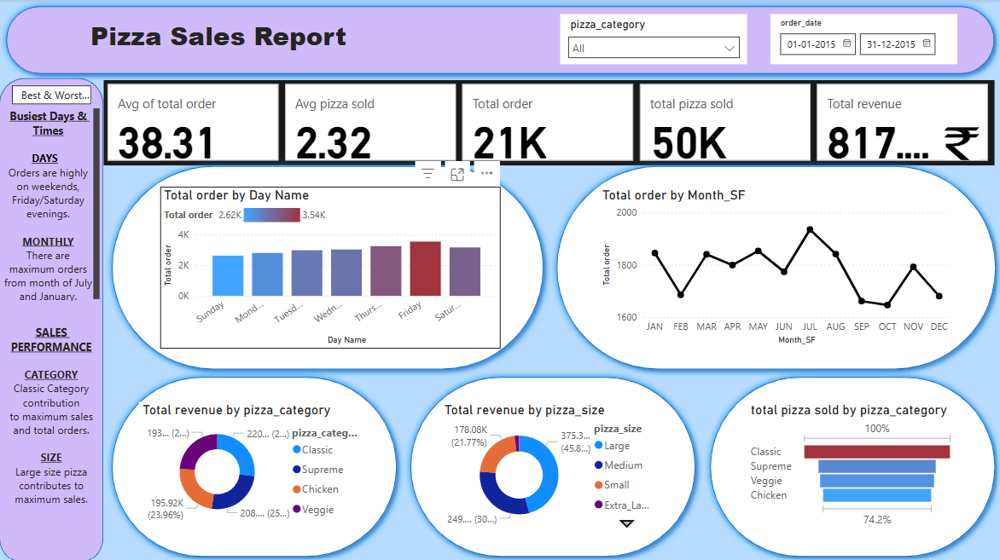
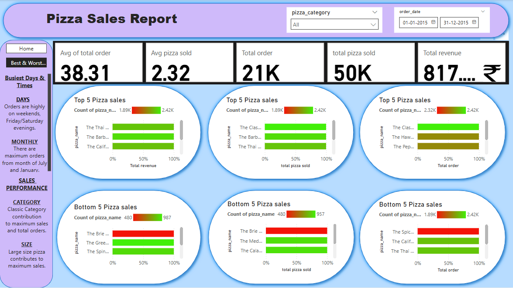

# 🍕 Pizza Sales Analysis

## 📊 Project Overview
This project analyzes pizza sales data using SQL and Power BI
to uncover insights related to revenue, order trends,
top-performing pizzas, and customer behavior.

## 🛠 Tools Used
- SQL
- Power BI
- Excel / CSV
- GitHub

## 📁 Project Structure
- dataset → raw pizza sales data  
- sql → SQL queries for analysis  
- powerbi → Power BI dashboard screenshots  

## 📈 Power BI Dashboards

### Dashboard 1

### Dashboard 2

## 🔍 Key Insights
- Highest number of orders occur on weekends
- Large-sized pizzas contribute the maximum revenue
- Classic category generates the highest sales
- Top 5 pizzas account for the majority of total revenue
